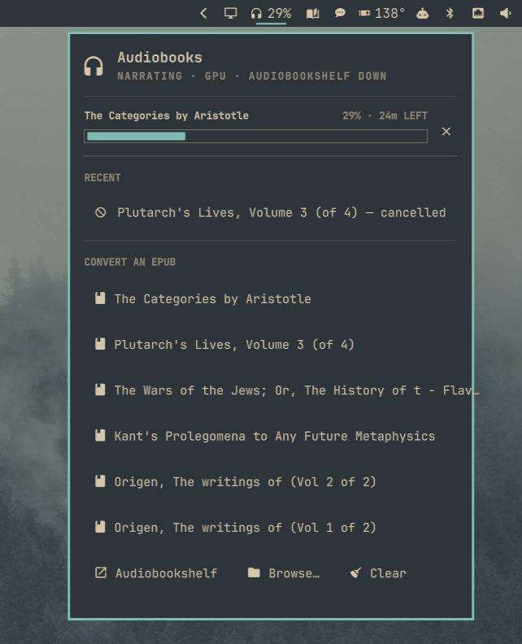
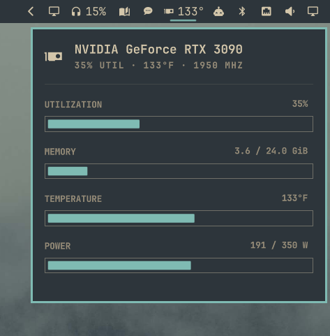

# omarchy-audiobook

An Omarchy bar widget + CLI that turns an EPUB into an M4B audiobook with
[ebook2audiobook](https://github.com/DrewThomasson/ebook2audiobook) on your
GPU, then files it into its own Audiobookshelf server and sends a
notification that opens the book when clicked. Point Absorb (or any
Audiobookshelf app) at that server to listen on your phone.



While the ebook is transcoding, you can see the [NVIDIA GPU - Omarchy bar widget](https://github.com/dimapanov/omarchy-nvidia) active, since the omarchy-audiobook plugin uses the local GPU to generate the audio.



There's nothing to set up first. On first use the plugin pulls the published
ebook2audiobook image (CUDA if you have a recent NVIDIA driver, CPU
otherwise), and each book runs in its own throwaway container. It also
starts an Audiobookshelf container in the background, which Docker keeps
running across reboots.

```
EPUB ──► docker run --rm --gpus all athomasson2/ebook2audiobook:v26.9.27-cu130 --headless …
     ──► ~/Audiobooks/<Author>/<Title>/<Title>.m4b (+ .vtt)
     ──► the plugin's Audiobookshelf rescans ──► notification → the book in Audiobookshelf
```

## Install

```sh
./install.sh
```

This copies the plugin into `~/.config/omarchy/plugins`, puts
`omarchy-audiobook` on your PATH, adds **Open With → Convert to Audiobook**
for EPUBs, and runs `omarchy-audiobook doctor --fix`. That last step
installs anything missing (Docker, the NVIDIA container toolkit, the docker
group; your password is needed for these), then downloads the image once:
5.6 GB for CUDA, 2.8 GB for CPU.

`omarchy plugin add <git-url>` works too. The widget handles the PATH and
Open With setup, and the image downloads on your first conversion with a
progress bar. If Docker or GPU access is missing, the panel shows a **fix**
row that opens a terminal running `doctor --fix`.

On the first conversion, ebook2audiobook also downloads about 2 GB of voice
and language models into `~/.local/share/omarchy-audiobook/models`. Later
books skip that step.

## Converting

- Click the headphones icon in the bar. The panel lists your most recent
  EPUBs (Downloads, Documents, Books, Archive/Books, Archive/Calibre); click
  one.
- In Files, right-click an EPUB and pick **Open With → Convert to Audiobook**.
- From a terminal, run `omarchy-audiobook convert book.epub [more.epub…]`.

Each job runs in a transient systemd user unit, so it survives closing
whatever started it. Books narrate one at a time; the rest wait as
"queued". While a job runs, the bar shows its percentage next to the icon,
and the panel shows progress, the time left and a cancel button.

## Audiobookshelf

The plugin runs Audiobookshelf 2.37.1 as the `omarchy-audiobook-abs`
container. It runs as you, uses `--restart unless-stopped`, and listens on
`http://localhost:13378` only. On first start the plugin sets it up without
asking:

- an admin account named after your login, with a generated password;
- a book library on `~/Audiobooks` (or `ABS_LIBRARY_DIR`), scanned right away;
- an API key the plugin uses to find new books and link to them.

These are saved in `~/.config/omarchy-audiobook/abs.env` (mode 600), not in
the plugin. Its database lives in `~/.local/share/omarchy-audiobook/abs/`.

`omarchy-audiobook server` shows the address and username, and
`omarchy-audiobook server password` prints the password. Use them to sign in
to the web UI.

### Absorb

Audiobookshelf only listens on this PC, so your phone needs a way to reach
it. The plugin doesn't open any ports itself. With
[Tailscale](https://tailscale.com) on both devices, share it on your tailnet
over HTTPS, which works anywhere without exposing it to your LAN or the
internet:

```sh
tailscale serve --bg 13378
```

The panel's **Listen on your phone** section then shows the address
(`https://<machine>.<tailnet>.ts.net`). In Absorb, add that server, use
**Copy password**, and sign in with your username.

## Config

`~/.config/omarchy-audiobook/config` is sourced as bash. Every setting is optional:

```sh
E2A_VARIANT=auto             # auto | cu130 | cpu
E2A_LANGUAGE=eng
E2A_EXTRA_ARGS=(--tts_engine xtts)
E2A_MODELS_DIR=~/.local/share/omarchy-audiobook/models
ABS_LIBRARY_DIR=~/Audiobooks # the library folder; existing books there get scanned
ABS_PORT=13378               # localhost port for the plugin's Audiobookshelf
ABS_MANAGED=true             # false: use an Audiobookshelf you run yourself, with
                             #   ABS_URL, ABS_CONTAINER, and `omarchy-audiobook setup`
EPUB_DIRS=("$HOME/Downloads" "$HOME/Books")
```

The ebook2audiobook version is pinned by the plugin (`E2A_VERSION`) and
moves with plugin releases. When it changes, the new image is pulled on the
next conversion and the old one is removed.

## CLI

```
omarchy-audiobook convert <file.epub>...  queue EPUBs
omarchy-audiobook status                  JSON of jobs and the engine (what the widget polls)
omarchy-audiobook epubs [n]               JSON of recent EPUBs
omarchy-audiobook cancel <id>             stop a job and its container
omarchy-audiobook open <id>               open a finished book
omarchy-audiobook log <id>                follow the ebook2audiobook output
omarchy-audiobook clear                   forget finished jobs
omarchy-audiobook doctor [--fix]          check (and repair) Docker, GPU access, the image and the server
omarchy-audiobook engine pull             download the image now
omarchy-audiobook server                  how to sign in (address, username)
omarchy-audiobook server password         print the generated password (copy-password: to clipboard)
omarchy-audiobook server up|down          start or stop the plugin's Audiobookshelf
omarchy-audiobook setup                   API key for an Audiobookshelf you run yourself (ABS_MANAGED=false)
omarchy-audiobook version                 plugin version
```

Job state lives in `~/.local/state/omarchy-audiobook/jobs/<id>.{json,log}`.

## Developing

Edit this checkout, then re-run `./install.sh --no-deps`. The shell's
file watcher doesn't follow symlinks, so the plugin is copied rather than
linked. If a QML change doesn't show up, run `omarchy restart shell`.

Releases follow [semver](https://semver.org). Add notes under
**Unreleased** in `CHANGELOG.md`, then run `scripts/release patch|minor|major`.
